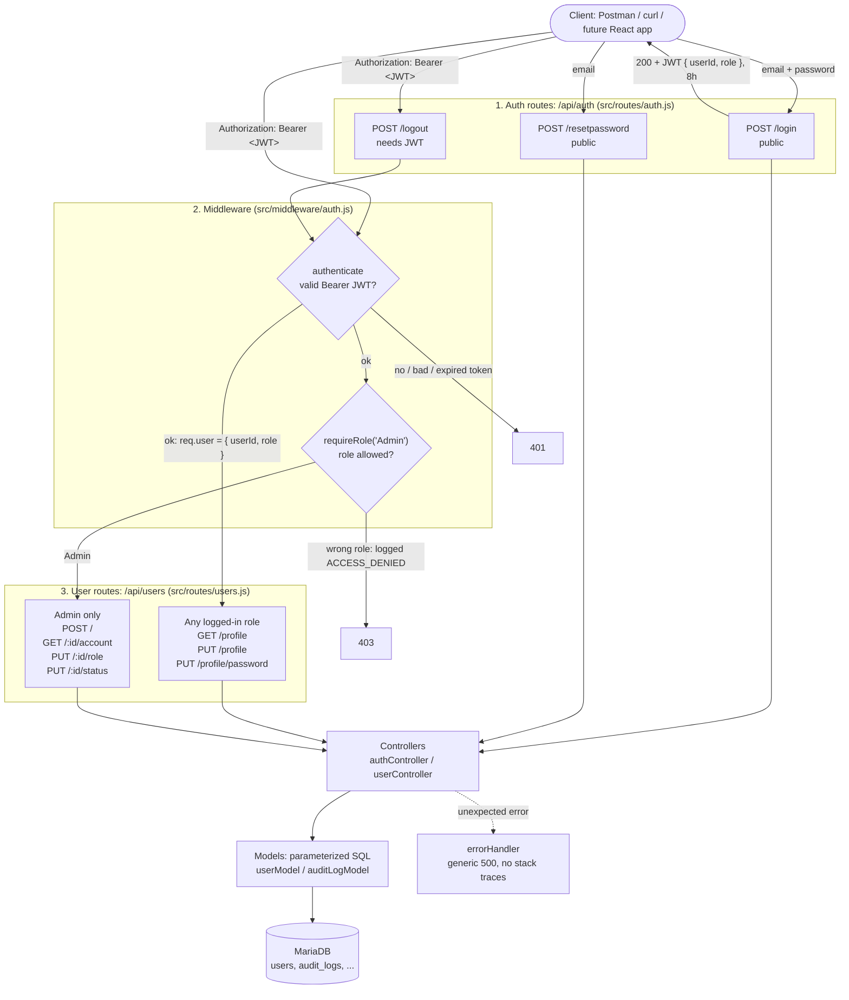

# Inventory Ordering Portal

Backend for an inventory ordering portal. Built with Express 5, MySQL/MariaDB, bcrypt and JWT.

**Current version: v1.0.0 (Milestone 1: authentication, roles and profile)**

## Diagram



### What happens to the JWT

1. **Login.** `POST /api/auth/login` checks the bcrypt hash and returns a JWT signed with `JWT_SECRET`. The token holds only `userId` and `role`, and it expires after 8 hours (`JWT_EXPIRES_IN`).
2. **Every protected request.** The client sends `Authorization: Bearer <token>`. `authenticate` verifies the signature and expiry, then sets `req.user`.
3. **Role check.** `requireRole` reads `req.user.role`. It never trusts a role sent in the request body.
4. **Logout.** The server returns 200 and writes an audit entry. The client then throws the token away.

## Design decisions

| Decision | Why |
|---|---|
| **Layers: route → middleware → controller → model** | Each layer does one job. Routes map URLs, middleware decides whether a request may continue, controllers hold the logic, and models hold all the SQL. Tests can replace the models with fakes and run without a database. |
| **JWT sessions with no server-side session store** | Any instance can verify a request using only the secret. The token contains `userId` and `role` and nothing sensitive. |
| **Logout doesn't revoke the token on the server** | Revoking a JWT needs a blacklist table, and the ERD doesn't have one. Logout logs the event (req 2.1.4) and the client drops the token. The 8h expiry limits how long a leaked token stays usable. |
| **Two middlewares: `authenticate` and `requireRole`** | Two questions: "who are you?" (401) and "are you allowed to do this?" (403). `requireRole('Admin')` is used per route, so adding Manager-only routes later takes one line. |
| **Access denials are logged** | `requireRole` writes `ACCESS_DENIED` to `audit_logs` before it returns 403 (req 3.2.3). Failed logins are logged too (req 3.2.2). |
| **bcrypt for passwords** | bcrypt is slow on purpose and salts each hash, so a stolen hash is expensive to brute-force (req 2.1.3). Passwords must be 16+ characters with uppercase, lowercase and a digit (req 2.1.2). |
| **Same error for an unknown email and a wrong password** | An attacker can't use login or password reset to find out which emails have accounts. |
| **Reset tokens are stored as SHA-256 hashes, valid for 1 hour** | A database leak can't be used to reset accounts. The token isn't emailed yet because no mailer is set up (req 2.1.5, partial). |
| **Parameterized SQL only** | Every query uses `?` placeholders, which protects against SQL injection (req 3.1.1). |
| **One central `errorHandler`** | Unexpected errors are logged on the server, and the client only gets a generic message (reqs 3.2.1, 3.2.4). |
| **The password hash is never selected for profile responses** | `toPublicUser()` builds responses from named fields only (req 2.2.2). |

## Running it

```bash
npm install
cp .env.example .env      # fill in DB credentials and JWT_SECRET
mysql -u <user> -p inventory_portal < db/schema.sql
npm run dev               # or: npm start
npm test                  # Jest + Supertest
```

## Status

- **Done (v1.0.0):** login, logout, password-reset request, role-based access, profile self-service, and admin account management.
- **Not built yet:** the endpoint that uses a reset token to set a new password, the React frontend, and products, orders and suppliers (later milestones).

For a full walkthrough and requirement coverage, see [MILESTONE_1_OVERVIEW.md](MILESTONE_1_OVERVIEW.md).
