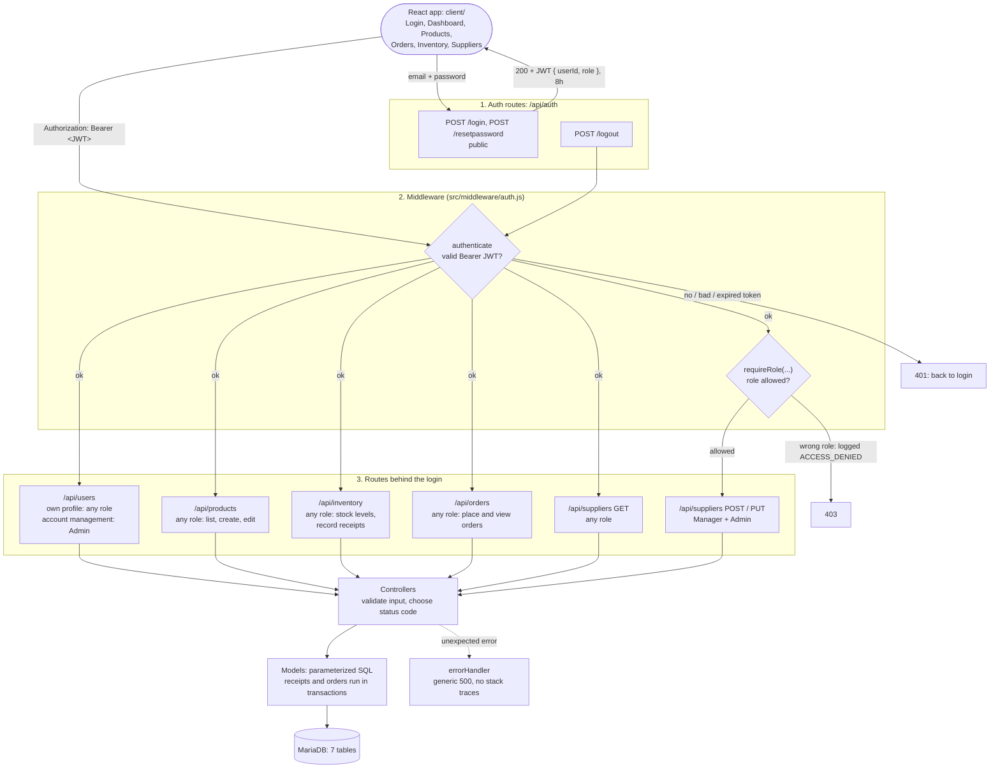
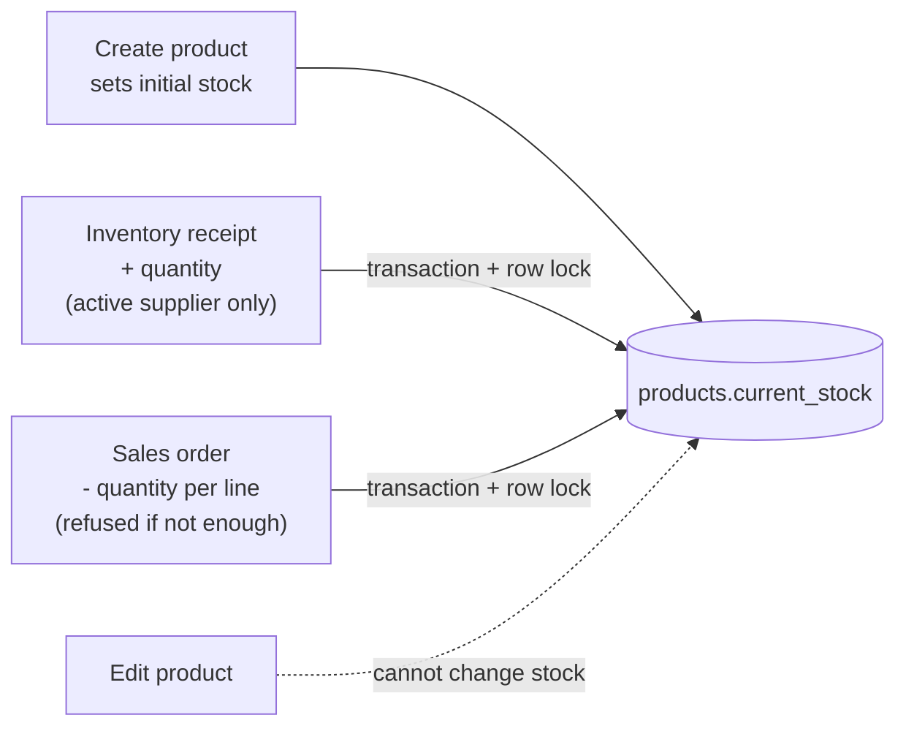

# Inventory Ordering Portal

[](https://github.com/Pedriux0/inventory-ordering-portal/actions/workflows/tests.yml) · [what each test covers](docs/TESTS.md)

Inventory and ordering portal with three roles: Staff, Manager and Admin. The frontend is React (Vite), and the backend uses Express 5, MySQL/MariaDB, bcrypt and JWT.

**Current version: v2.0.0 (Milestone 2: products, inventory receipts, orders, suppliers and the React frontend)**

## Diagram


```mermaid
flowchart TD
    Browser([React app: client/<br/>Login, Dashboard, Products,<br/>Orders, Inventory, Suppliers])

    subgraph R1["1. Auth routes: /api/auth"]
        Login["POST /login, POST /resetpassword<br/>public"]
        Logout["POST /logout"]
    end

    subgraph R2["2. Middleware (src/middleware/auth.js)"]
        Authn{"authenticate<br/>valid Bearer JWT?"}
        Authz{"requireRole(...)<br/>role allowed?"}
    end

    subgraph R3["3. Routes behind the login"]
        Users["/api/users<br/>own profile: any role<br/>account management: Admin"]
        Products["/api/products<br/>any role: list, create, edit"]
        Inventory["/api/inventory<br/>any role: stock levels,<br/>record receipts"]
        Orders["/api/orders<br/>any role: place and view orders"]
        SupRead["/api/suppliers GET<br/>any role"]
        SupWrite["/api/suppliers POST / PUT<br/>Manager + Admin"]
    end

    Ctrl["Controllers<br/>validate input, choose status code"]
    Model["Models: parameterized SQL<br/>receipts and orders run in transactions"]
    DB[(MariaDB: 7 tables)]
    Err["errorHandler<br/>generic 500, no stack traces"]

    Browser -->|email + password| Login
    Login -->|"200 + JWT { userId, role }, 8h"| Browser
    Browser -->|"Authorization: Bearer &lt;JWT&gt;"| Authn
    Logout --> Authn

    Authn -->|"no / bad / expired token"| E401["401: back to login"]
    Authn -->|ok| Users
    Authn -->|ok| Products
    Authn -->|ok| Inventory
    Authn -->|ok| Orders
    Authn -->|ok| SupRead
    Authn -->|ok| Authz
    Authz -->|"wrong role: logged ACCESS_DENIED"| E403["403"]
    Authz -->|allowed| SupWrite

    Users --> Ctrl
    Products --> Ctrl
    Inventory --> Ctrl
    Orders --> Ctrl
    SupRead --> Ctrl
    SupWrite --> Ctrl
    Ctrl --> Model --> DB
    Ctrl -.->|unexpected error| Err
```

### How stock changes


```mermaid
flowchart LR
    Create["Create product<br/>sets initial stock"] --> Stock[(products.current_stock)]
    Receipt["Inventory receipt<br/>+ quantity<br/>(active supplier only)"] -->|transaction + row lock| Stock
    Order["Sales order<br/>- quantity per line<br/>(refused if not enough)"] -->|transaction + row lock| Stock
    Edit["Edit product"] -.->|cannot change stock| Stock
```

Stock can only change in these three ways, and each receipt or order keeps a record (`inventory_receipts`, `order_items`), so the current stock can always be traced back through those records.

### What happens to the JWT

1. **Login.** `POST /api/auth/login` checks the bcrypt hash and returns a JWT signed with `JWT_SECRET`. The token holds only `userId` and `role`, and it expires after 8 hours.
2. **In the browser.** The React app keeps the token in `sessionStorage`, so it's cleared when the tab closes. `client/src/api.js` adds it to every request as `Authorization: Bearer <token>`.
3. **Every protected request.** `authenticate` verifies the signature and expiry, then sets `req.user`. `requireRole` reads the role from the token, never from the request body.
4. **Expired token.** Any 401 response sends the user back to the login page.
5. **Logout.** The server returns 200 and writes an audit entry. The client then deletes the token.

## Design decisions

### Milestone 1: auth, roles and profile

| Decision | Why |
|---|---|
| **Layers: route → middleware → controller → model** | Each layer does one job. Models hold all the SQL, so the tests can replace them with fakes and run without a database. |
| **JWT sessions with no server-side session store** | A request can be verified using only the secret. The token contains `userId` and `role` and nothing sensitive. |
| **Logout doesn't revoke the token on the server** | Revoking a JWT needs a blacklist table, and the ERD doesn't have one. Logout logs the event (req 2.1.4). The 8h expiry limits how long a leaked token stays usable. |
| **Two middlewares: `authenticate` and `requireRole`** | Two questions: "who are you?" (401) and "are you allowed to do this?" (403). Both access denials and failed logins are logged (reqs 3.2.2, 3.2.3). |
| **bcrypt, 16+ character passwords** | bcrypt is slow on purpose and salts each hash (reqs 2.1.2, 2.1.3). |
| **Same error for an unknown email and a wrong password** | Login and password reset can't be used to find out which emails have accounts. |
| **Reset tokens stored as SHA-256 hashes** | A database leak can't be used to reset accounts (req 2.1.5; the token isn't emailed yet). |
| **Parameterized SQL and one central `errorHandler`** | Every query protects against SQL injection (req 3.1.1), and users never see internal errors (reqs 3.2.1, 3.2.4). |

### Milestone 2: products, inventory, orders and suppliers

| Decision | Why |
|---|---|
| **Stock only changes through receipts and orders** | Editing a product can't change its stock. That keeps `current_stock` consistent with the receipt and order history. |
| **Receipts and orders run in one transaction with `SELECT ... FOR UPDATE`** | Every part of an order is saved, or nothing is. If two people sell the last units at the same moment, the second one waits and is then refused. This is tested against a real database (req 3.4.1). |
| **Stock math in plain functions (`src/utils/stock.js`)** | UT-03 and UT-04 test the exact functions the models use, without needing a database. |
| **The price is copied into `order_items.unit_price_at_sale`** | Changing a product's price later doesn't change past orders. Totals are calculated in cents to avoid rounding errors. |
| **Suppliers: Staff can view, Manager and Admin can change** | Reqs 2.2.5 and 2.5.6 name Manager, and Admin is included because it has full access to the system. Staff need to read the list to record receipts. |
| **Suppliers are deactivated, never deleted** | Receipts point to suppliers with a foreign key, so deleting one would break the history. Deactivated suppliers can't receive new stock. |
| **Who did it comes from the token** | `received_by` and `orders.user_id` come from `req.user`, so a user can't record actions under someone else's name. |
| **Products, receipts and orders open to every role** | Reqs 2.5.1–2.5.4 give these to Staff, and Manager and Admin can do everything Staff can. |
| **The UI hides buttons, but the API enforces the rules** | Staff don't see "New supplier", and the API also returns 403 if they call it directly. |
| **No "category" field** | Mockup 3 shows one, but the ERD and requirement 2.4.1 don't, so the ERD wins. |

## Running it locally

```bash
# backend
npm install
cp .env.example .env              # fill in DB credentials and JWT_SECRET
mysql -u root -p < db/schema.sql  # creates the database and 7 tables
npm run seed                      # demo users, suppliers and products (local only)
npm run dev                       # API on http://localhost:3000

# frontend (second terminal)
cd client
npm install
npm run dev                       # http://localhost:5173, /api is forwarded to :3000
```

Demo logins (created by `npm run seed`):

| Role | Email | Password |
|---|---|---|
| Admin | admin@demo.com | DemoAdminPass2026 |
| Manager | manager@demo.com | DemoManagerPass2026 |
| Staff | staff@demo.com | DemoStaffPass2026 |

## Tests

| Command | What it runs |
|---|---|
| `npm test` | Unit and API tests (Jest + Supertest), with the models mocked so no database is needed |
| `npm run test:db` | Real-database tests: UT-09, stock after a receipt or order, rollback, and two simultaneous orders |
| `cd client && npm run test:e2e` | Cypress frontend tests (FE-01–05, FE-10, FE-11). The app must be running and seeded |

If Cypress fails to start from a VS Code terminal with `bad option: --ping`, run it as `env -u ELECTRON_RUN_AS_NODE npm run test:e2e`.

## Deploying

See [deploy/DEPLOY.md](deploy/DEPLOY.md) for the Hostinger VPS setup: NGINX serves the React build and forwards `/api` to Express, which runs under PM2.

## Status

- **Milestone 1 (v1.0.0):** login, logout, password-reset request, role-based access, profile and admin account management (API only).
- **Milestone 2 (v2.0.0 → v2.3.0):** Staff sales orders need Manager approval (client change to 2.5.3, v2.3.0), purchase requests with Manager approval (2.2.5, v2.2.0), products (2.4.1, 2.5.1), inventory receipts and stock (2.4.2, 2.5.2, 2.5.4), sales orders (2.4.3, 2.5.3), suppliers (2.2.5, 2.4.4, 2.5.6), the React frontend for all of these, and the deploy configuration.
- **Not built yet:** search, sort and pagination (Week 7), the reset-token "set new password" endpoint, and the profile and user-admin screens (the API for them exists).

Requirement-by-requirement walkthroughs: [MILESTONE_1_OVERVIEW.md](MILESTONE_1_OVERVIEW.md) and [MILESTONE_2_OVERVIEW.md](MILESTONE_2_OVERVIEW.md).
